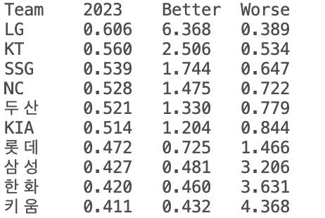

2024 KBO 순위예측 대회를 위한 Project Page

# 정답 제출 방식
매우잘할팀 : 

잘할팀 :

못할팀 :

매우못할팀:

*각 항목에 들어가는 팀 수에는 제한이 없으며 (매우잘할팀, 매우못할팀을 여러개 넣어서 맞추면 얻는 보너스 점수 1/n 띵, 하나도 안적으면 잘/못할팀을 모두 매우잘/못할팀으로 간주하겠음) 0개 넣는 것도 가능. 각 팀은 한 항목에만 들어가야 하며, 아무곳에도 넣지 않아도됨(해당 팀은 점수 계산에서 제외)

# 채점 방식

각 팀에 대하여 [(2024년 승률)-(2023년 승률)]x(해당 팀의 가중치)를 계산하여 더한 값에 매우잘할팀(뺀값이 가장 큰 팀), 매우못할팀(뺀 값이 가장 작은 팀) 보너스 점수를 더해 최종점수 계산(각각 10% 보너스). 가중치는 위 그림과 같이 정해짐.

가중치의 경우 LG를 예를 들면 

잘할것으로 예측하고 실제로 잘함 -> 6.368배로 점수 획득

잘할것으로 예측하고 실제로 못함 -> 0.389배로 점수 잃음

못할것으로 예측하고 실제로 잘함 -> 6.368배로 점수 잃음

못할것으로 예측하고 실제로 못함 -> 0.389배로 점수 얻음

# 최종 우승자 선정
정규 시즌을 마치고 최종점수 상위 5인이 순서대로 포스트시즌 진출팀을 선택. 각 팀의 포스트시즌 순위가 최종 순위로 결정

1위에게는 (머리수)x5000원, 2위에게는 (머리수)x2500원 상당의 선물을(참가자들이 엔빵해서)~

# 가중치의 결정 (혹시 궁금할까봐..)
Source Code - weight.py

Method - 1969년부터 2023년까지의 메이저리그의 연속시즌 승률을 이용하여 전년도 승률의 Logit 값을 이용하여 다음해 승률의 Logit을 예측하는 선형회귀 모델 만듬. 이 모델로부터 승률이 p인 팀의 다음해 승률이 증가할 때의 증가폭 기댓값, 감소할 때의 감소폭 기댓값을 얻음. 이 값을 weight로 사용

많이 하는 질문 1 - 코드를 보면 승률의 Logit이 정규분포 따른다고 가정한 것 같은데 실제로 그런가요?

답변 1 - 저도 모릅니다. 애초에 한 시즌의 야구팀 승률 분포를 모르니.. 걍 그런셈 쳐주세요.

많이 하는 질문 2 - 정규분포는 가정시, 증가폭 기댓값을 구한 방식이 궁금해요!

답변 2 - X~Norm dist'n 이고 전년도 승률의 Logit이 k라고 합시다. 그럼 이때, k의 Logit값을 기준으로 X에서 뽑은 표본(올시즌의 성적)의 증가 폭이 점수에 곱해질 것입니다. 이 때 가중치의 역할은, 어떤 답을 하더라도 점수의 기댓값이 0이 되는 것에 목적을 두고있습니다. 예를 들어 증가한다고 답을 했다면 (증가할 확률)x(증가할 때의 조건부 기댓값)x(가중치 1)+(감소할 확률)x(감소할 때의 조건부 기댓값)x(가중치 2)=0 이 되는 것이 목적입니다. (증가할 확률):(감소할 확률)=(X의 pdf를 k로 절단시 면적 비)가 되고 조건부 기댓값 부분을 각팀의 승률이 0.5 근처이므로 Logit 변형 전도 선형적이라는 가정하에(계산상의 편의를 위해) 아래 절단정규분포의 Mean값을 활용하면, (증가할 때의 조건부 기댓값):-(감소할 때의 조건부 기댓값)=(X의 pdf를 k로 절단시 면적 비)가 됩니다. 따라서 (가중치 1):(가중치 2)=1/(X의 pdf를 k로 절단시 면적 비)^2를 얻을 수 있으며, 승률이 0.5일때 가중치가 1이 되도록 하면 저 값을 얻을 수 있습니다!

(절단정규분포 - https://en.wikipedia.org/wiki/Truncated_normal_distribution)
